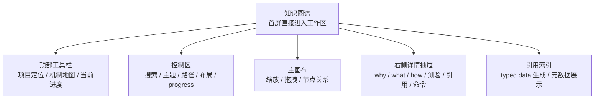
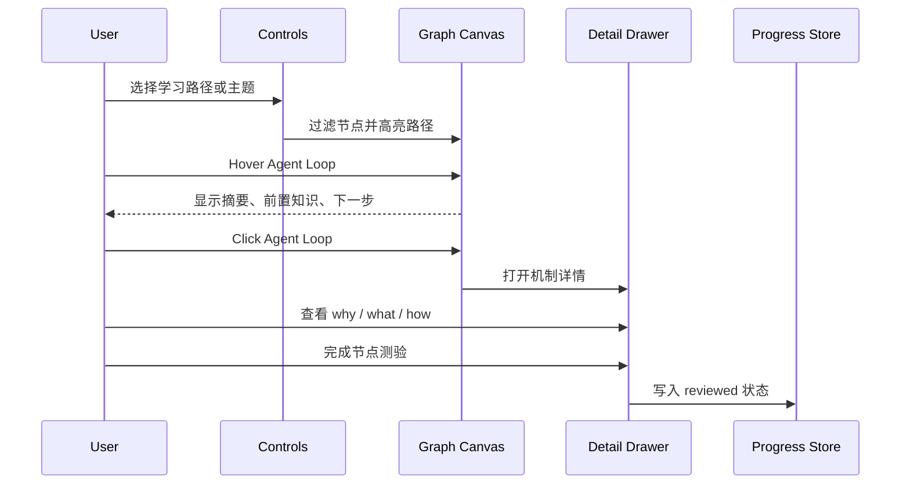
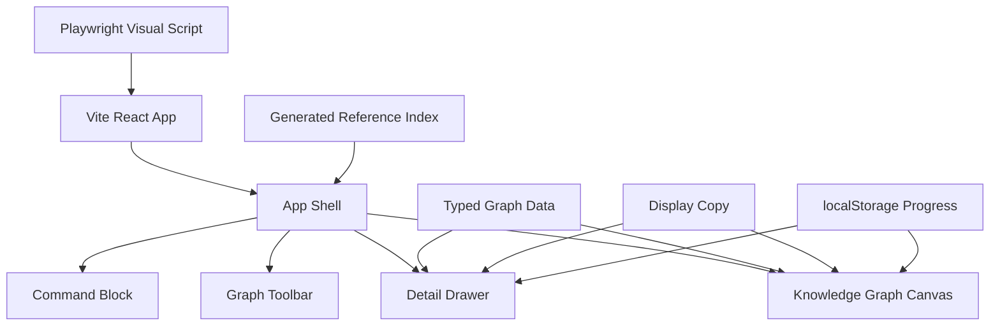

# Claude Code Harness 可交互知识图谱整体设计

学习进度：知识图谱前端设计 `[■■■■■] 100%`

## 产品定位

`apps/knowledge-graph` 是 `agent-harness-lab` 的展示型前端工程，用来说明：

1. 对 Claude Code-like harness 机制的系统理解。
2. 前端信息架构、交互设计和可访问性能力。
3. TypeScript 数据建模、React 组件拆分和 Bun 工程能力。

它不替代 `labs/ts-agent/`。`labs/ts-agent/` 继续放教学版 harness 代码，知识图谱负责把这些机制组织成可读、可操作的学习界面。

## 信息架构



## 用户路径



## 当前功能

- 可缩放、可拖拽的知识图谱主画布。
- 节点 hover 展开摘要、前置知识、推荐下一步。
- 节点 click 打开右侧 detail drawer。
- detail drawer 包含 why / what / how 可视化卡片、引用、demo 命令、常见误解、教学版 vs 生产版、节点测验。
- 支持主题过滤：foundation、tool-system、planning、context、safety、runtime、multi-agent、extension、dream。
- 支持路径模式：Beginner Path、Context Path、Safety Path、Advanced Path。
- 支持 progress 状态：not-started、learning、implemented、reviewed。
- 支持 progress localStorage 持久化、JSON 导入、JSON 导出。
- 支持引用面板：local docs、lab source、CCB source mapping、external links。
- 支持从 typed data 生成引用索引。
- 支持 Playwright 视觉回归截图。

## 推荐方案

采用 root-level app：

```text
D:\agent-harness-lab\apps\knowledge-graph
```

不采用 `labs/ts-agent/apps/knowledge-graph`，因为这个前端是展示型工程，不只是 lab 内部 demo。

不采用根目录直接 Vite app，避免和 CCB 的 `src/`、`packages/`、`docs/` 语义冲突。

## 技术架构



技术选择：

- Runtime：Bun。
- App：Vite + React + TypeScript。
- 图谱：typed data + React/CSS 自研画布。
- 图标：不引入图标库，遵守 `DESIGN.md`。
- 状态：组件内 React state，progress 写入 localStorage。
- 样式：CSS variables + 模块化组件样式。
- 数据：TypeScript seed graph。
- 持久化：localStorage 保存 progress。

## 数据模型草案

```ts
export type Theme =
  | "foundation"
  | "tool-system"
  | "planning"
  | "context"
  | "safety"
  | "runtime"
  | "multi-agent"
  | "extension"
  | "dream";

export type LearningPathId =
  | "beginner"
  | "context"
  | "safety"
  | "advanced";

export type ProgressStatus =
  | "not-started"
  | "learning"
  | "implemented"
  | "reviewed";

export type ReferenceKind =
  | "local-doc"
  | "lab-source"
  | "ccb-source-mapping"
  | "external-link";
```

## 第一批知识节点

| 主题 | 节点 |
|---|---|
| foundation | Message、System Prompt、Agent Loop、Model Adapter、Tool Use、Tool Result Write-back |
| tool-system | Tool Registry、Tool Schema、Tool Context、read_file、write_file / list_files、run_shell |
| planning | TodoWrite、TodoRead、Task State |
| context | Project Rules、Memory、Skills、Compact、Context Budget |
| safety | Permissions、Policy Presets、Approval Request、Approval Store、Path Guard |
| runtime | Bun Runtime、Vite React Shell、Demo Commands |
| multi-agent | Subagents、Background Tasks、Worktree Isolation |
| extension | MCP、Plugin Loader |
| dream | Memory Hygiene |

## 组件拆分

- `AppShell`：整体布局和能力卡片。
- `GraphToolbar`：顶部说明和跳转。
- `KnowledgeGraphCanvas`：画布、搜索、主题筛选、路径模式、布局模式、progress。
- `DetailDrawer`：右侧详情、why / what / how、节点测验、引用面板、对照说明。
- `CommandBlock`：可复制 Bun 命令。
- `generatedReferenceIndex`：由脚本生成的引用索引。

## 视觉方向

- 像专业开发工具和知识操作台。
- 内容可以多，但每一屏要能快速扫读。
- 避免营销 landing page、空洞 hero、通用紫色渐变。
- 节点是结构入口，不承载长文。
- 详情抽屉承载解释、引用和 demo。
- 卡片半径控制在 8px 以内。

## 可访问性

- 节点支持键盘 focus。
- `Enter` 打开详情，`Esc` 关闭详情。
- hover 内容也能通过 focus 触发。
- drawer 关闭后焦点回到原节点。
- progress 不只靠颜色表达。
- 支持 `prefers-reduced-motion`。

## 内容与安全边界

- 只保存原创摘要、路径引用、URL 和简短说明。
- 不复制 CCB 源码、第三方正文、skill-hub 内容或任何 `SKILL.md` 内容。
- 不使用远程数据源作为 MVP 数据输入。
- 不添加 analytics、tracking script、远程日志或 token 处理。
- 不使用 `dangerouslySetInnerHTML`。
