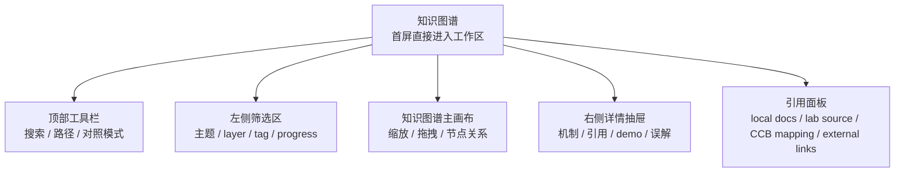
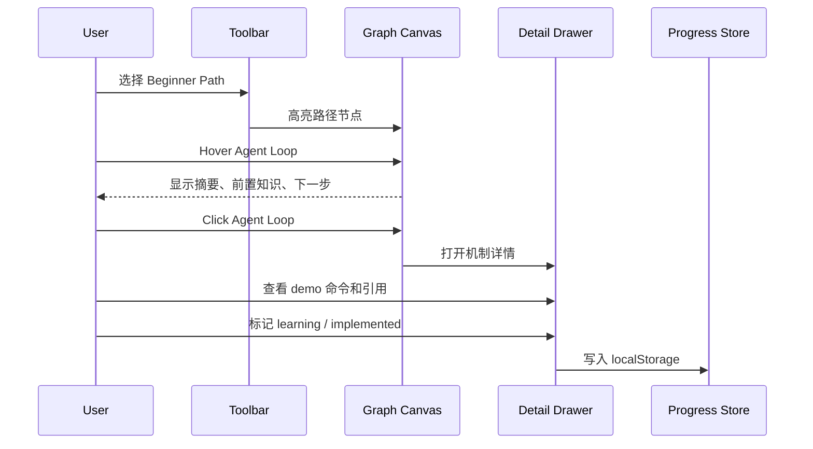
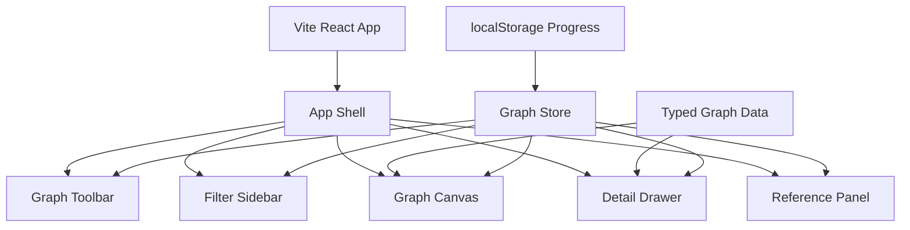

# Claude Code Harness 可交互知识图谱整体设计

学习进度：知识图谱前端设计 `[██████████] 100%`

## 产品定位

`apps/knowledge-graph` 是 `agent-harness-lab` 的展示型前端工程，用来说明：

1. 对 Claude Code-like harness 机制的系统理解。
2. 前端信息架构、交互设计和可访问性能力。
3. TypeScript 数据建模、React 组件拆分和 Bun 工程化能力。

它不替代 `labs/ts-agent/`。`labs/ts-agent/` 继续放教学版 harness 代码，知识图谱负责把这些机制组织成可阅读、可操作的学习界面。

## 信息架构



## 用户路径



## MVP 功能

- 可缩放、拖拽的知识图谱主画布。
- 节点 hover 展开摘要、前置知识、推荐下一步。
- 节点 click 打开右侧 detail drawer。
- detail drawer 包含机制解释、存在原因、教学版 lab 文件引用、CCB 对照引用、外部资料引用、demo 命令、常见误解。
- 支持主题过滤：foundation、tool-system、planning、context、safety、runtime、multi-agent、extension、dream。
- 支持路径模式：Beginner Path、Context Path、Safety Path、Advanced Path。
- 支持“教学版 vs 生产版”对照模式。
- 支持 progress 状态：not-started、learning、implemented、reviewed。
- 支持引用面板：local docs、lab source、CCB source mapping、external links。
- 支持搜索节点、按 layer/tag/path 筛选节点。

## 推荐方案

采用 root-level app：

```text
D:\agent-harness-lab\apps\knowledge-graph
```

不采用 `labs/ts-agent/apps/knowledge-graph`，因为这个前端是展示型工程，不只是 lab 内部 demo。

不采用根目录直接 Vite app，避免和 CCB 的 `src/`、`packages/`、`docs/` 语义冲突。

## 技术架构



技术选择：

- Runtime：Bun。
- App：Vite + React + TypeScript。
- 图谱：MVP 先使用 typed data + React/CSS 自研静态画布，交互阶段再评估是否引入 React Flow。
- 图标：不引入图标库，遵守 `DESIGN.md`，仅使用文字和极少数极简箭头。
- 状态：Zustand 优先，复杂度不够时也可以先用 Context + Reducer。
- 样式：CSS variables + 模块化组件样式。
- 数据：TypeScript 静态 seed graph。
- 持久化：localStorage 只保存 progress 和视图偏好。

## 数据模型草案

```ts
export type Theme =
  | "foundation"
  | "tool-system"
  | "planning"
  | "context"
  | "safety"
  | "runtime"
  | "multi-agent"
  | "extension"
  | "dream";

export type LearningPathId =
  | "beginner"
  | "context"
  | "safety"
  | "advanced";

export type ProgressStatus =
  | "not-started"
  | "learning"
  | "implemented"
  | "reviewed";

export type ReferenceKind =
  | "local-doc"
  | "lab-source"
  | "ccb-source-mapping"
  | "external-link";

export type SourceReference = {
  id: string;
  kind: ReferenceKind;
  title: string;
  target: string;
  note?: string;
};

export type KnowledgeNode = {
  id: string;
  title: string;
  theme: Theme;
  layer: number;
  tags: string[];
  summary: string;
  prerequisites: string[];
  recommendedNext: string[];
  labFiles: SourceReference[];
  ccbMappings: SourceReference[];
  externalLinks: SourceReference[];
  misconceptions: string[];
  demoCommands: string[];
  compare: {
    teachingVersion: string;
    productionVersion: string;
  };
};

export type KnowledgeEdge = {
  id: string;
  source: string;
  target: string;
  relation: "prerequisite" | "extends" | "contrasts" | "runtime-flow";
};
```

## 第一批知识节点

| 主题 | 节点 |
|---|---|
| foundation | Message、System Prompt、Agent Loop、Model Adapter、Tool Use、Tool Result Write-back |
| tool-system | Tool Registry、Tool Schema、Tool Context、read_file、write_file / list_files、run_shell |
| planning | TodoWrite、TodoRead、Task State |
| context | Project Rules、Memory、Skills、Compact、Context Budget |
| safety | Permissions、Policy Presets、Approval Request、Approval Store、Hooks、Path Guard |
| runtime | Bun Runtime、Vite React Shell、Demo Commands |
| multi-agent | Subagents、Task Runtime、Background Tasks、Agent Teams、Worktree Isolation |
| extension | MCP、Plugin Loader |
| dream | Dream、Memory Hygiene |

## 组件拆分

- `AppShell`：整体布局。
- `GraphToolbar`：搜索、路径、对照模式。
- `FilterSidebar`：theme、layer、tag、progress。
- `KnowledgeGraphCanvas`：图谱画布容器。
- `KnowledgeNodeCard`：自定义节点。
- `NodeHoverCard`：hover 摘要。
- `DetailDrawer`：右侧详情。
- `ReferencePanel`：四类引用。
- `PathModeTabs`：学习路径切换。
- `ProgressControl`：progress 状态切换。
- `CompareBlock`：教学版和生产版对照。
- `CommandBlock`：可复制 Bun 命令。
- `KeyboardHelpDialog`：键盘帮助。

## 视觉方向

- 像专业开发工具和知识操作台。
- 内容可以多，但每一屏要能快速扫读。
- 避免营销 landing page、空洞 hero、通用紫色渐变。
- 节点是结构入口，不承载长文。
- 详情抽屉承载解释、引用和 demo。
- 卡片半径控制在 8px 以内，按钮优先 icon + tooltip。

## 可访问性

- 节点支持键盘 focus。
- `Enter` 打开详情，`Esc` 关闭详情。
- hover 内容也能通过 focus 触发。
- drawer 关闭后焦点回到原节点。
- progress 不只靠颜色表达。
- 提供节点列表视图作为 canvas 的键盘替代入口。
- 支持 `prefers-reduced-motion`。

## 内容与安全边界

- 只保存原创摘要、路径引用、URL 和简短说明。
- 不复制 CCB 源码、第三方正文、skill-hub 内容或任何 `SKILL.md` 内容。
- 不使用远程数据源作为 MVP 数据输入。
- 不添加 analytics、tracking script、远程日志或 token 处理。
- 不使用 `dangerouslySetInnerHTML`。
