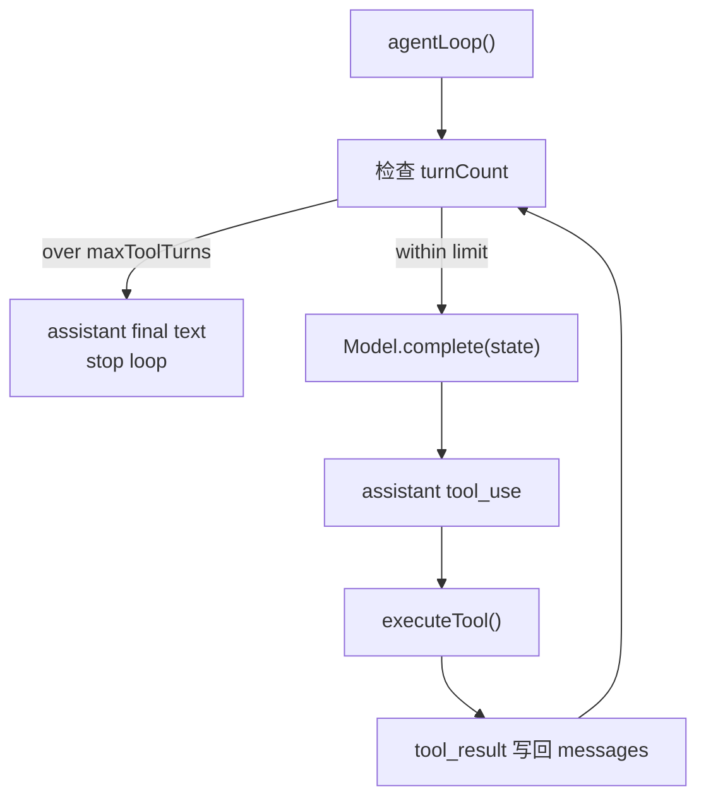

# Loop Boundaries

阶段 1 的 agent loop 让工具调用闭环跑起来。现在要补一个边界：loop 不能无限执行工具。

## 为什么需要 maxToolTurns

如果模型一直返回 `tool_use`，harness 不能盲目执行下去。真实系统里这会导致：

- 工具反复执行。
- 消耗 token 和时间。
- 文件或 shell 工具造成重复副作用。

所以 agent loop 需要自己的执行边界。

## 当前实现



## 运行观察

```powershell
Set-Location D:\learn-cc\labs\ts-agent; bun run loop-limit-demo
```

这个 demo 注入了一个永远返回 `echo` 工具调用的模型，但 `agentLoop(..., { maxToolTurns: 3 })` 会在第三轮工具结果之后停止。

停止原因也会写进 `LoopState.stopReason`：

- `end_turn`：模型正常结束。
- `max_tool_turns`：harness 达到最大工具轮数后强制停止。

`loop-limit-demo` 和 `model-demo` 会打印完整 `LoopState`，方便直接观察 `stopReason`。
