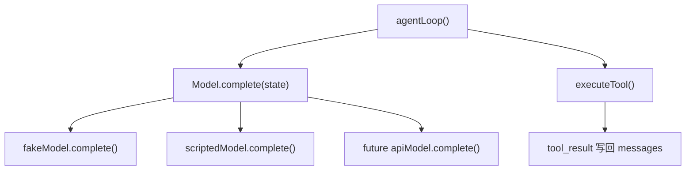

# Model Interface

`Model` 是 agent loop 和具体模型实现之间的边界。

## 为什么需要 Model 接口

如果 `loop.ts` 直接调用 `fakeModel()`，后续接真实模型 API 时就会不断改 loop。更好的结构是让 loop 只知道一件事：模型实现必须提供 `complete(state)`。



## 当前实现

- `model.ts`：定义 `Model` 和 `ModelResponse`。
- `fake-model.ts`：教学 fake model，实现 `Model`。
- `scripted-model.ts`：第二个模型实现，用来证明 loop 可以注入任意模型。
- `model-injection-demo.ts`：把 `scriptedModel` 注入同一个 `agentLoop`。

## 运行观察

```powershell
Set-Location D:\learn-cc\labs\ts-agent; bun run model-demo
```

如果输出里出现 `scripted-tool-1`，说明执行的不是默认 fake model，而是注入的 scripted model。
