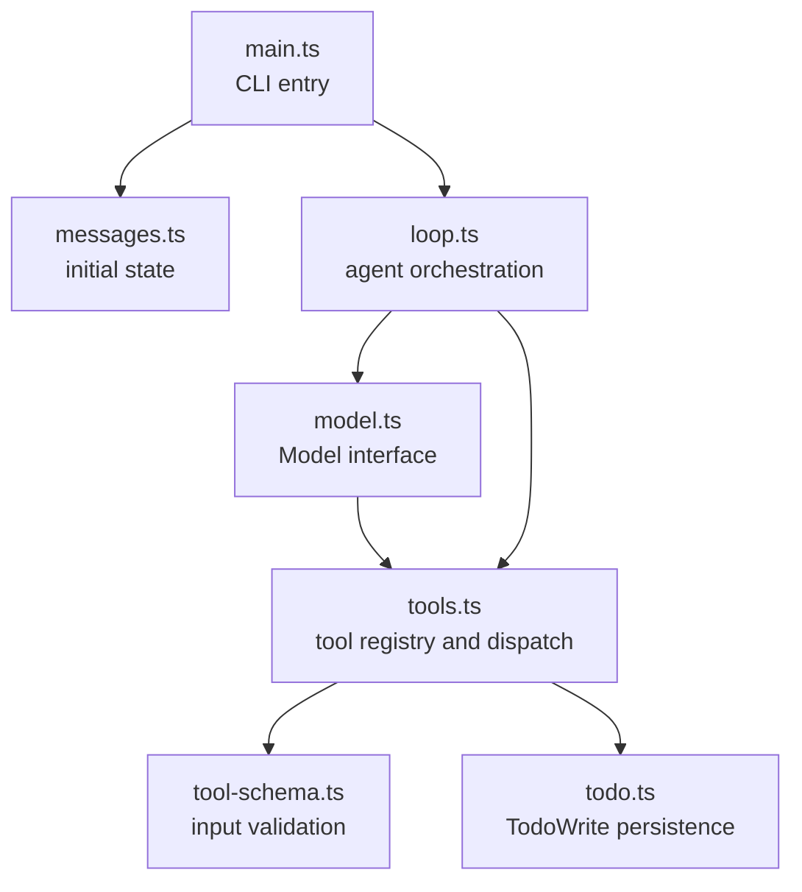

# Module Boundaries

这一页记录教学版 agent harness 的模块拆分。

## 当前拆分



## 为什么拆 fake-model.ts

拆分前，`loop.ts` 同时负责两件事：

- agent loop：调用模型、执行工具、把 `tool_result` 写回 messages。
- fake model：根据输入字符串选择工具、根据错误做恢复、驱动 TodoWrite 工作流。

拆分后，`loop.ts` 只保留 harness 编排逻辑。后续接真实模型 API 时，只需要替换 `fake-model.ts` 这一侧，而不用重写 agent loop。

## Model 接口

`model.ts` 定义了 loop 需要的最小模型接口：

```ts
type Model = {
  complete(state: LoopState): Promise<ModelResponse>;
};
```

`loop.ts` 不关心模型来自 fake model、Anthropic API、OpenAI API，还是本地规则引擎。只要它实现 `complete()`，就能接入同一个 agent loop。

## 运行观察

```powershell
Set-Location D:\learn-cc\labs\ts-agent; bun run dev "please run planned file task"
```

这个命令仍然应该输出：

```text
todo_write -> write_file -> todo_write -> final text
```
