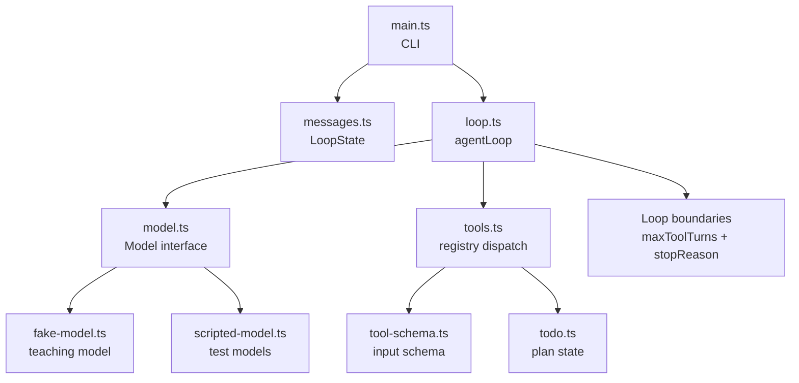

# Stage 3 Checkpoint

阶段 3 已完成的核心目标：把 agent loop 从“能调用工具”推进到“能维护计划状态、替换模型实现、限制循环边界”。

## 已实现机制

- `todo_write`：写入结构化计划状态。
- `todo_read`：读取计划状态。
- Todo 状态边界：最多一个 `in_progress`，内容不能为空。
- Todo 驱动工作流：`todo_write -> write_file -> todo_write`。
- `Model` 接口：`agentLoop` 不绑定具体模型实现。
- 模型注入 demo：同一 loop 可运行 scripted model。
- loop 执行边界：`maxToolTurns`。
- stop reason：`end_turn` / `max_tool_turns`。

## 当前模块图



## 必跑命令

```powershell
Set-Location D:\learn-cc\labs\ts-agent; bun run typecheck
```

```powershell
Set-Location D:\learn-cc\labs\ts-agent; bun run dev "please run planned file task"
```

```powershell
Set-Location D:\learn-cc\labs\ts-agent; bun run model-demo
```

```powershell
Set-Location D:\learn-cc\labs\ts-agent; bun run loop-limit-demo
```

## 本章核心句

TodoWrite 不是 UI 待办清单，而是 harness 维护的计划状态。

Model 接口不是抽象洁癖，而是让 loop 不依赖某个具体 provider。

Loop 边界不是模型礼貌退出，而是 harness 自己保护执行过程。
