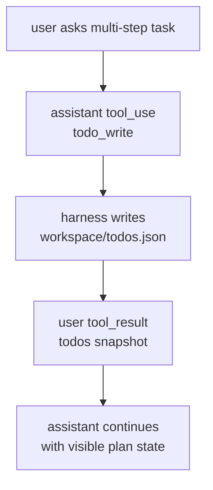
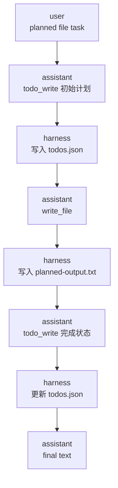

# TodoWrite

阶段 3 的重点：Todo 不是普通文件笔记，而是 agent harness 显式维护的任务状态。

## 为什么需要 TodoWrite

多步任务如果只存在模型回复里，下一轮很容易丢失细节。TodoWrite 把计划写成结构化状态：



## 当前最小实现

- `todo_write`：替换当前 todo 列表。
- `todo_read`：读取当前 todo 列表。
- 存储位置：`labs/ts-agent/workspace/todos.json`。
- 状态枚举：`pending`、`in_progress`、`completed`。
- 状态约束：同一时刻最多一个 `in_progress`，todo 内容不能为空。

## 计划驱动工作流

当前 fake model 还演示了一个多步流程：



这说明 TodoWrite 不是单独的侧边功能。它和文件工具共享同一条 tool registry 管道，只是负责维护计划状态。

## 运行观察

写入计划：

```powershell
Set-Location D:\learn-cc\labs\ts-agent; bun run dev "please create todo plan"
```

运行计划驱动的文件任务：

```powershell
Set-Location D:\learn-cc\labs\ts-agent; bun run dev "please run planned file task"
```

读取计划：

```powershell
Set-Location D:\learn-cc\labs\ts-agent; bun run dev "please read todos"
```

观察 TodoWrite 状态边界和恢复：

```powershell
Set-Location D:\learn-cc\labs\ts-agent; bun run dev "please create bad state todo"
```

注意：教学版 fake model 用简单字符串匹配模拟模型选择工具，所以更具体的意图要先匹配。例如 `read todos` 必须排在普通 `read_file` 之前。

查看工具上下文：

```powershell
Set-Location D:\learn-cc\labs\ts-agent; bun run tool-context
```

## 核心句

TodoWrite 不是让模型“记一下”，而是让 harness 接管计划状态，把计划变成后续推理可以观察、更新和恢复的数据。
