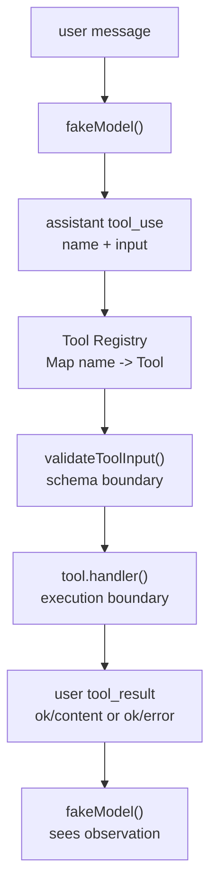
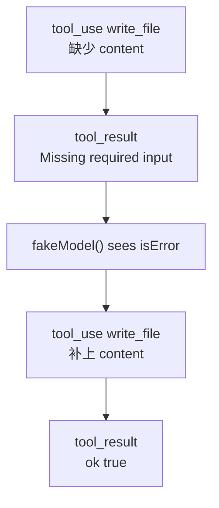

# Tool Registry

阶段 1 的 Agent Loop 已经解决了一个问题：

```text
assistant tool_use -> harness execute tool -> user tool_result -> assistant final text
```

阶段 2 解决的是另一个问题：模型说“我要用某个工具”之后，harness 如何知道它能不能用、该怎么用、失败时怎么写回。

## 工具不是普通函数

普通函数只关心调用者传参和返回值。Agent harness 里的工具还必须带上边界信息：

- `name`：模型请求工具时使用的稳定名字。
- `description`：给模型看的能力说明。
- `inputSchema`：输入字段、类型、必填项。
- `handler`：真正执行动作的函数。
- 执行边界：文件路径只能在 `workspace/`，shell 只能跑 allowlist。
- 结果格式：成功和失败都写成结构化 `tool_result`。

## 当前数据流



## 当前内置工具

| 工具 | 能力 | 边界 |
|---|---|---|
| `echo` | 返回文本 | 需要 `text: string` |
| `read_file` | 读取 workspace 内文件 | 路径不能逃出 `workspace/` |
| `write_file` | 写入 workspace 内文件 | 自动创建目录，路径不能逃出 `workspace/` |
| `list_files` | 列出 workspace 内目录 | 默认不递归 |
| `run_shell` | 运行安全简化版 shell | 只允许 allowlist 命令，禁止 shell 控制操作符 |
| `todo_write` | 写入当前任务计划 | todo 必须有 `content` 和 `status` |
| `todo_read` | 读取当前任务计划 | 无输入 |

## 运行观察

下面的命令必须在 `labs/ts-agent/` 目录执行。仓库根目录也有一个 `dev` 脚本，但它启动的是 CCB 的开发 CLI，不是这个教学实验。

查看模型可发现的工具目录：

```bash
Set-Location D:\learn-cc\labs\ts-agent; bun run tools
```

查看会注入给模型的工具上下文：

```bash
Set-Location D:\learn-cc\labs\ts-agent; bun run tool-context
```

成功路径：

```bash
Set-Location D:\learn-cc\labs\ts-agent; bun run dev "please write a file"
Set-Location D:\learn-cc\labs\ts-agent; bun run dev "please read a file"
Set-Location D:\learn-cc\labs\ts-agent; bun run dev "please list files"
Set-Location D:\learn-cc\labs\ts-agent; bun run dev "please run shell"
```

失败路径：

```bash
Set-Location D:\learn-cc\labs\ts-agent; bun run dev "please use unknown tool"
Set-Location D:\learn-cc\labs\ts-agent; bun run dev "please write bad input"
Set-Location D:\learn-cc\labs\ts-agent; bun run dev "please list unknown field"
Set-Location D:\learn-cc\labs\ts-agent; bun run dev "please read escape file"
Set-Location D:\learn-cc\labs\ts-agent; bun run dev "please run unsafe shell"
```

这些失败不是异常终止，而是 harness 生成的观察结果。下一轮模型应该能从 `tool_result.isError` 和 JSON 错误内容里恢复。

## 错误恢复

当前 fake model 已经能演示一层恢复：

```bash
Set-Location D:\learn-cc\labs\ts-agent; bun run dev "please write bad input"
```

流程是：



真实模型不会靠 `if error.includes(...)` 这样写死规则。这里故意写得很直白，是为了看清机制：错误被写回 messages 后，模型才有机会基于观察修正下一步动作。

## 这一阶段的核心句

工具调用不是“模型调用函数”。

更准确地说：模型提出一个动作请求，harness 用 registry 找能力，用 schema 验输入，用执行边界控风险，最后把成功或失败都写回 messages。
