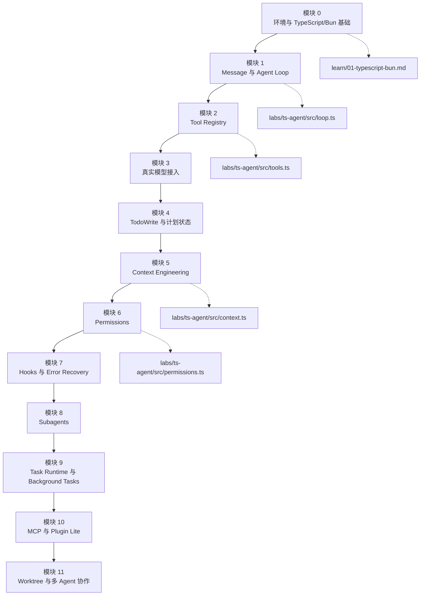
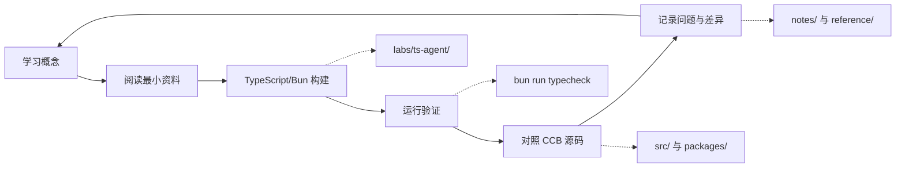
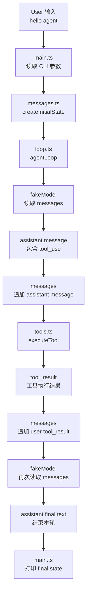
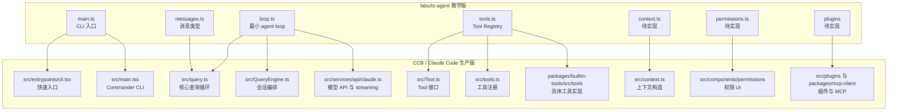
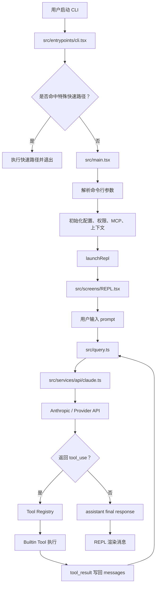
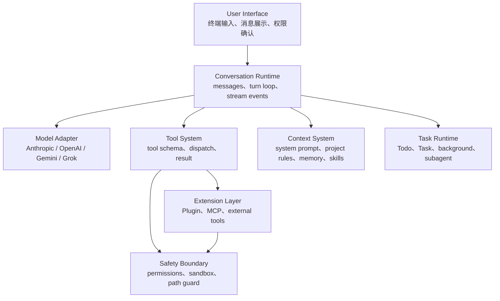
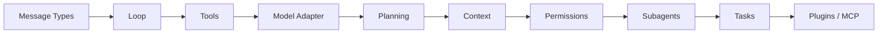
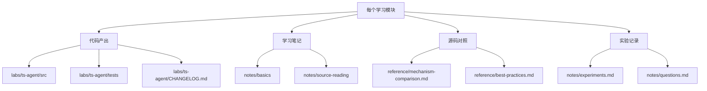
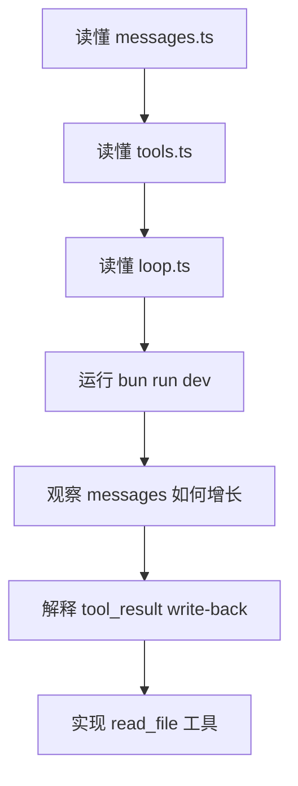

# Mermaid 学习地图

这页用 Mermaid 把学习路线、Claude Code/CCB 对应组件和 agent 工作流画出来。

## 1. 总体学习路线

## 2. 每个模块的固定学习节奏

## 3. 教学版 Agent Loop 工作流

这是 `labs/ts-agent` 当前最小版本的工作流。

关键点：

- `messages[]` 是下一轮模型推理输入，不只是显示记录。
- `tool_result` 必须写回 `messages[]`。
- 这就是 agent 从“会说话”变成“会做事”的最小流程。

## 4. 教学版到生产版的组件映射

## 5. Claude Code 生产级主链路

这是从命令行输入到模型调用、工具执行、UI 更新的大致链路。

## 6. Agent Harness 核心分层

学习时的顺序是自底向上搭：

## 7. 模块与产出物关系

## 8. 当前阶段你应该盯住的流程

当前不要急着接真实模型。先确保你能不用模型也解释清楚：

- message 是什么。
- tool_use 是什么。
- tool_result 为什么要回填。
- loop 为什么会继续跑下一轮。
